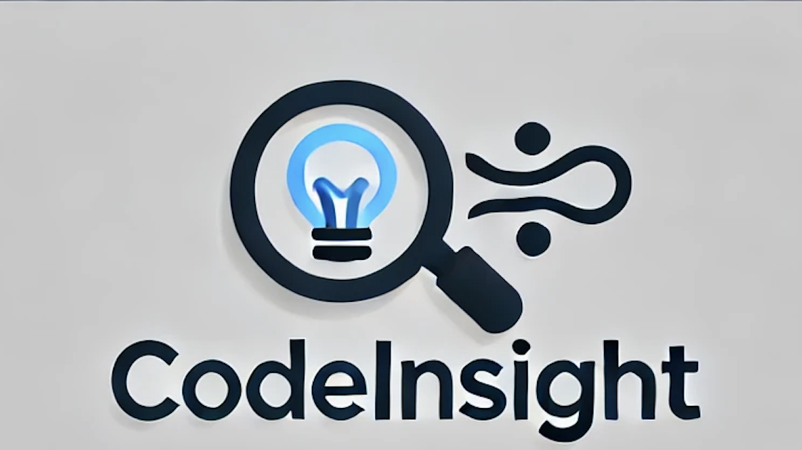
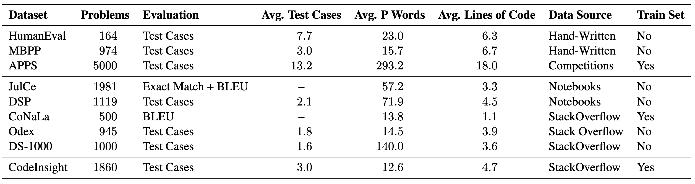

<p align="center">
  
</p>

## Overview
The **CodeInsight** dataset is designed for code generation tasks, providing developers with expert-curated examples that bridge the gap between conceptual intent and functional code. This dataset aids in both model fine-tuning and evaluation, addressing common challenges faced by developers.
Our article is available on [ACL anthology](https://aclanthology.org/2024.findings-acl.354/).

## Dataset Description


- **Purpose**: To support developers in generating Python code by providing clarified intents, associated code snippets, and related unit tests.
- **Content**: 
  - 3,409 unique, expert-curated Python code examples
  - Includes clarified intents, code snippets, and an average of three related unit tests per example.
  - Covers a wide range of libraries, including Pandas, Numpy, Regex, and over 70 standard Python libraries derived from Stack Overflow.

  

## Dataset Structure

The **CodeInsight** dataset consists of two main folders: `train` and `test`. Each folder contains indexed examples structured as follows:

- **train/** (indexed from 0 to 930)
- **test/** (indexed from 0 to 2479)

Each example is contained within its own folder named by its index. The structure inside each indexed folder includes:

- **.cfg** file: Contains metadata about the example, structured as follows:
  ```plaintext
  [library]
  lib = ['NoImport']

  [labels]
  labels = ['builtin']

  [test]
  test_case_cnt = 3

  [origin]
  source = https://stackoverflow.com/questions/961632
  ```
- **code.txt**: Contains the code for the example.
- **nl.txt**: Contains the natural language description of the example.
- **prompt.txt**: Contains the natural language concatenated with the function signature.
- **unit_tests/**: A folder containing test files named test_{i}.py with the corresponding unit tests.
  
## Cloning the Repository and Running the Reference Check

To clone the CodeInsight repository and run the reference check, you can use the following commands:

```bash
git clone https://github.com/NathanaelBeau/CodeInsight.git

cd CodeInsight
conda env create -f environment.yml 
conda activate your_environment_name

python check_reference.py
```

## Quick Start

To use the **CodeInsightDataset**, follow these steps:

```python
from codeinsight import CodeInsightDataset

# Load the dataset for fine-tuning (train or test)
train_dataset = CodeInsightDataset(source_dir='./CodeInsight', mode='fine_tuning', split='train')
test_dataset = CodeInsightDataset(source_dir='./CodeInsight', mode='fine_tuning', split='test')

# Alternatively, load all the data for both fine-tuning and evaluation
all_dataset = CodeInsightDataset(source_dir='./CodeInsight', mode='all')

# Access an example by index
example = train_dataset[0]
print("Code:", example['code'])
print("Natural Language:", example['nl'])

# Run tests on the example's code
result = example.test(example['code'], timeout_duration=10)
print(f"Tests for problem {example.problem_id}: {'PASSED' if result else 'FAILED'}")
```

# Citation

If you use this dataset in your research, please cite the following:

```bibtex
@inproceedings{DBLP:conf/acl/BeauC24,
  author       = {Nathana{\"{e}}l Beau and
                  Beno{\^{\i}}t Crabb{\'{e}}},
  editor       = {Lun{-}Wei Ku and
                  Andre Martins and
                  Vivek Srikumar},
  title        = {CodeInsight: {A} Curated Dataset of Practical Coding Solutions from
                  Stack Overflow},
  booktitle    = {Findings of the Association for Computational Linguistics, {ACL} 2024,
                  Bangkok, Thailand and virtual meeting, August 11-16, 2024},
  pages        = {5935--5947},
  publisher    = {Association for Computational Linguistics},
  year         = {2024},
  url          = {https://aclanthology.org/2024.findings-acl.354},
  timestamp    = {Tue, 27 Aug 2024 17:38:11 +0200},
  biburl       = {https://dblp.org/rec/conf/acl/BeauC24.bib},
  bibsource    = {dblp computer science bibliography, https://dblp.org}
}
```

# Acknowledgements

The creation of the CodeInsight dataset was made possible through the generous support of onepoint. Their financial contribution was essential in enabling the research and development of this dataset, designed to aid developers in common programming tasks. 
